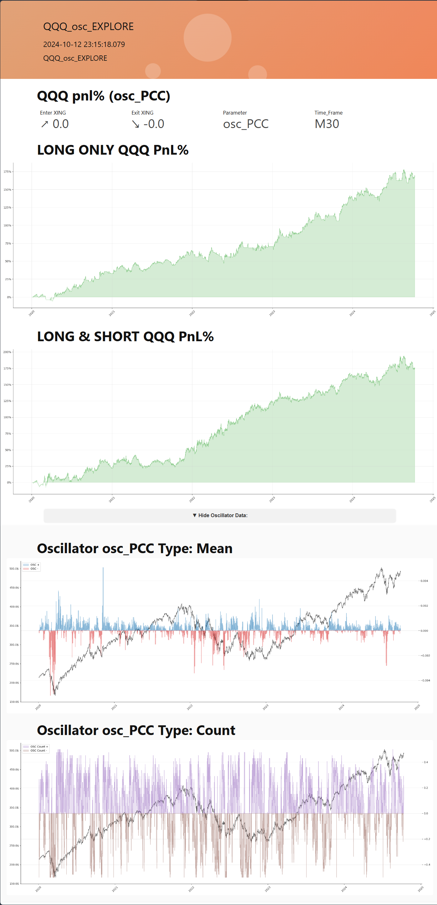

# Tool Reporter Library (Easy-to-use Generator of HTML Reports)

The Tool Reporter Library is a Python library designed to generate detailed HTML reports. It is easy to use and allows you to create comprehensive reports with various types of content, including text, plots, DataFrames, and more.

## Features
- Generate HTML reports with customizable simple to use Blocks.
- Result HTML always a single file, which make it easy to share by email, or chat.
- Add text, plots, DataFrames, show/hide regions and code blocks to the report.
- New reports with same name stored with nex index and created date-time, and automatically can be opened. (e.g. rprt, rprt_01, rprt_02, ..)


## Installation
1. Clone the repository:

    ```bash
    git clone https://github.com/dmitrydnk1/Tool_Reporter_Lib.git
    ```
2. Navigate to the project directory:

    ```bash
    cd repository
    ```
3. Install with required dependencies:

    ```bash
    pip install .
    ```

## Code Examples:
For more examples, please refer to the [Code Examples Floder](examples/) with:

1. [1-st Step: Reporter Configuration](examples/1-step_initial_CFG_setup.py)

2. [Basic Reporter Example](examples/basic_report_generation.py)
    
    > [Link to Basic Report Example](https://dmitrydnk1.github.io/Tool_Reporter_Lib/assets/basic_report_(0001).html)

3. [Detailed Reporter Example](examples/detailed_report_eneration.py)
    
    > [Link to Detailed Report Example](https://dmitrydnk1.github.io/Tool_Reporter_Lib/assets/my_report_(0015).html)

## View Example Report
You can view an example HTML report by clicking the link below:

> [Open Example Report (Click to View)](https://dmitrydnk1.github.io/Tool_Reporter_Lib/assets/QQQ_osc_EXPLORE.html)

## Generated Report Example



[Example Folder](assets/)

## Usage
Here's a basic example of how to use the Tool Reporter Library to generate a report:

```python
from tool_reporter_lib import ReportHTML
import matplotlib.pyplot as plt
import numpy as np

# Create a report object
report = ReportHTML(title = 'My Report')

# Add a title
report.add_title('Welcome Title', h_level = 1, use_center = True)

# Add some text
report.add_text('Hello, this is a small text.')

# Add a plot
x = np.linspace(0, 10, 100)
y = np.sin(x)

plt.plot(x, y)
report.add_plot(plt, use_fullwidth = False)

# Save the report
report.save()
```